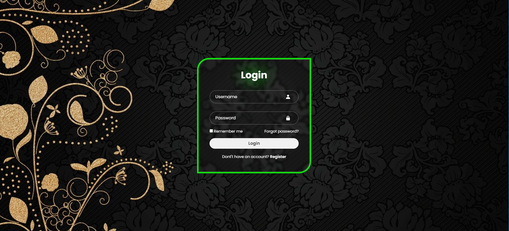

# Simple Login Page

This is a simple login page designed using HTML, CSS, and Boxicons. It provides basic functionality for users to enter their username and password, with an option to remember their login credentials.

## Features

- Username and password input fields.
- Checkbox to remember login credentials.
- Forgot password link.
- Registration link for users who don't have an account.

## Technologies Used

- HTML
- CSS
- [Boxicons](https://boxicons.com/): For iconography.

## Installation

1. Clone this repository or download it as a ZIP file.
2. Open the downloaded files in your preferred code editor or web browser.

## Live Demo

Check out the live demo [here](https://your-demo-url.com).

## Usage

1. Open the `index.html` file in your web browser.
2. Enter your username and password.
3. Optionally, check the "Remember me" checkbox.
4. Click the "Login" button to submit your credentials.

## Notes

- This login page does not have any backend functionality. It's purely front-end and serves as a visual demonstration.
- Passwords are not securely stored or processed. This is for demonstration purposes only.

Feel free to explore and modify the code as needed!
